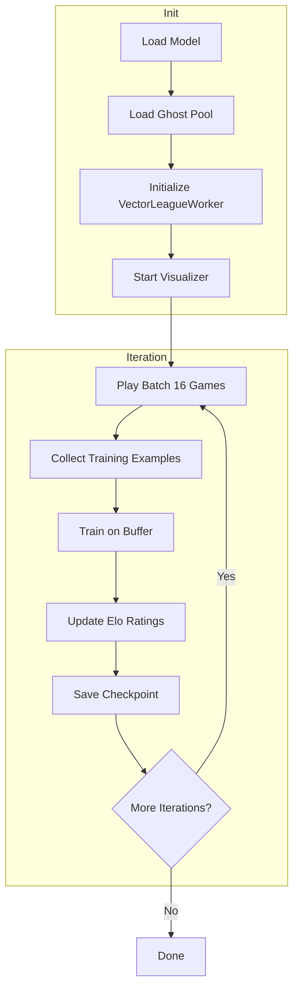
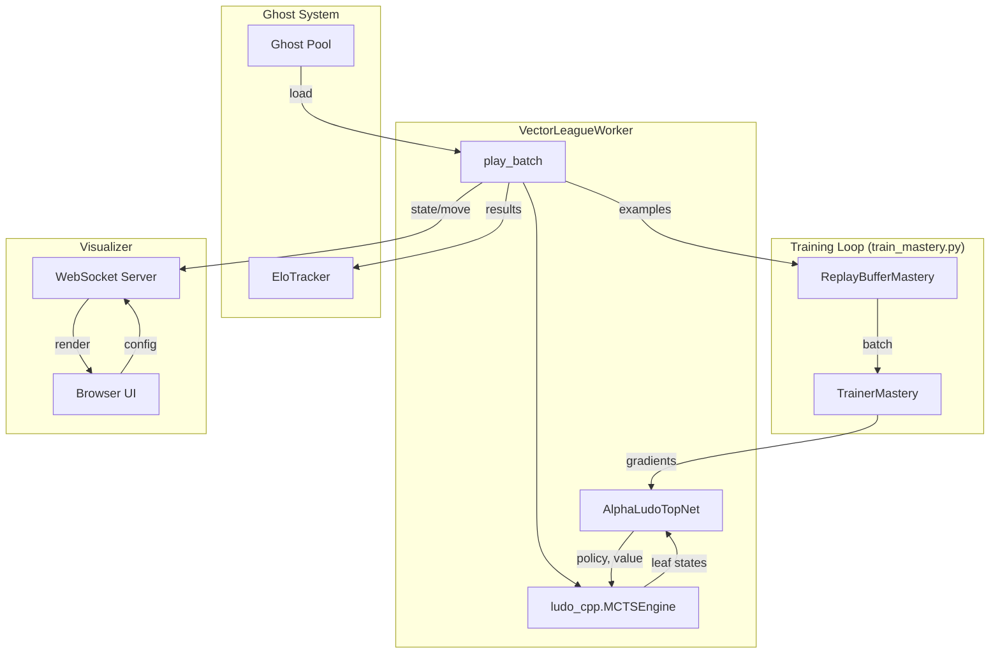

# AlphaLudo Architecture Documentation

> **Comprehensive documentation of the AlphaLudo codebase — an AlphaZero-style AI for Ludo**

---

## Table of Contents

1. [Project Overview](#project-overview)
2. [Directory Structure](#directory-structure)
3. [Core Components](#core-components)
4. [Training Pipeline](#training-pipeline)
5. [C++ Engine (ludo_cpp)](#c-engine-ludo_cpp)
6. [Neural Networks](#neural-networks)
7. [MCTS Implementations](#mcts-implementations)
8. [Worker Classes](#worker-classes)
9. [Utility Modules](#utility-modules)
10. [Visualizer System](#visualizer-system)
11. [Data Flow Diagram](#data-flow-diagram)
12. [Configuration & Parameters](#configuration--parameters)

---

## Project Overview

AlphaLudo is an AlphaZero-inspired AI for the board game Ludo. It combines:

- **Monte Carlo Tree Search (MCTS)** for look-ahead planning
- **Deep Neural Networks** for policy (which move to make) and value (who will win) estimation
- **Self-Play** for generating training data
- **League Training** with ghost/specialist opponents for robust learning

### Key Features

| Feature | Description |
|---------|-------------|
| **C++ Game Engine** | High-performance Ludo implementation with Python bindings |
| **Batched MCTS** | Process multiple games simultaneously in C++ |
| **MPS/CUDA Support** | GPU acceleration for neural network inference |
| **Real-time Visualizer** | WebSocket-based game visualization in browser |
| **Elo Tracking** | Track model improvement over training |
| **Ghost System** | Train against previous versions of itself |

---

## Directory Structure

```
AlphaLudo/
├── train_mastery.py         # Main training script (recommended)
├── train.py                 # Basic training script
├── train_league.py          # League training with specialists
├── train_specialist.py      # Specialist (reward shaping) training
├── visualizer.html          # Browser-based game visualizer (1123 lines)
├── setup.py                 # C++ extension build configuration
│
├── src/                     # Source code
│   ├── game.cpp/h           # C++ Ludo game engine
│   ├── mcts.cpp/h           # C++ batched MCTS engine
│   ├── bindings.cpp         # pybind11 Python bindings
│   │
│   ├── model.py             # Basic neural network (8-channel input)
│   ├── model_mastery.py     # Advanced network (12-channel, spatial policy)
│   ├── model_v3.py          # v3 network (21-channel, 4-action policy)
│   │
│   ├── mcts.py              # Python MCTS (stochastic)
│   ├── mcts_mastery.py      # Python MCTS for mastery architecture
│   │
│   ├── vector_league.py     # Main batched worker (uses C++ MCTS)
│   ├── vector_mcts.py       # Python batched MCTS wrapper
│   ├── league.py            # League worker (Python MCTS)
│   ├── league_mastery.py    # League worker for mastery architecture
│   ├── self_play.py         # Basic self-play worker
│   ├── specialist.py        # Reward shaping worker
│   │
│   ├── tensor_utils.py      # State → tensor conversion (8 channels)
│   ├── tensor_utils_mastery.py  # State → tensor (21 channels, v3)
│   ├── train_v3.py          # v3 trainer with TD(λ) and aux loss
│   │
│   ├── trainer.py           # Training loop (optimizer, loss)
│   ├── training_utils.py    # Temperature, augmentation, Elo
│   ├── replay_buffer.py     # Experience buffer
│   ├── replay_buffer_mastery.py  # Buffer for mastery architecture
│   │
│   ├── visualizer.py        # WebSocket server for visualization
│   └── evaluator.py         # Evaluation against bots
│
├── tests/                   # Unit tests
│   ├── test_engine.py       # C++ engine tests
│   ├── test_mcts.py         # MCTS tests
│   ├── test_model.py        # Neural network tests
│   └── ...
│
├── checkpoints_mastery/     # Training checkpoints
│   └── {run_name}/
│       ├── model_latest.pt  # Latest checkpoint
│       └── ghost_*.pt       # Historical snapshots
│
└── venv/                    # Python virtual environment
```

---

## Core Components

### Architecture Comparison

| Component | Basic | Mastery | **v3 (Current)** |
|-----------|-------|---------|------------------|
| **Model** | `AlphaLudoNet` (8-ch) | `AlphaLudoTopNet` (12-ch) | `AlphaLudoV3` (21-ch) |
| **MCTS** | Python | C++ Batched | C++ Batched + Dirichlet |
| **Tensor** | 8-channel | 12-channel | 21-channel (token-distinct) |
| **Policy** | 4 tokens (GAP) | Spatial 225 | 4 tokens (masked softmax) |
| **Workers** | `SelfPlayWorker` | `VectorLeagueWorker` | `VectorLeagueWorker` |
| **Aux Head** | ❌ | ❌ | ✅ Safety prediction |

---

## Training Pipeline

### `train_mastery.py` (Recommended)

Main training orchestrator with these phases:



**Key Parameters:**

| Parameter | Default | Description |
|-----------|---------|-------------|
| `SP_BATCH_SIZE` | 16 | Games per iteration |
| `mcts_simulations` | 200 | MCTS sims per move |
| `ghost_fraction` | 25% | Games vs ghost opponents |
| `temp_schedule` | `alphazero` | Temperature schedule |

### Other Training Scripts

| Script | Purpose | Use Case |
|--------|---------|----------|
| `train.py` | Basic self-play | Quick prototyping |
| `train_league.py` | League with specialists | Pre-trained specialist pool |
| `train_specialist.py` | Reward shaping | Train aggressive/defensive bots |

---

## C++ Engine (`ludo_cpp`)

### Files

| File | Lines | Purpose |
|------|-------|---------|
| `game.h` | 46 | Game state structure, function declarations |
| `game.cpp` | 347 | Ludo rules, move generation, state update |
| `mcts.h` | 92 | MCTS node and engine class declarations |
| `mcts.cpp` | 293 | Batched MCTS implementation |
| `bindings.cpp` | 89 | pybind11 Python bindings |

### GameState Structure

```cpp
struct GameState {
    array<array<int8_t, 15>, 15> board;       // -1 empty, 0-3 player ID
    array<array<int8_t, 4>, 4> player_positions; // -1=base, 0-50=path, 51-55=home_run, 99=home
    array<int8_t, 4> scores;                  // Tokens home per player
    int8_t current_player;                    // 0-3
    int8_t current_dice_roll;                 // 1-6
    bool is_terminal;
};
```

### Key Functions

| Function | Description |
|----------|-------------|
| `create_initial_state()` | Create new game |
| `get_legal_moves(state)` | Returns `vector<int>` of token indices (0-3) |
| `apply_move(state, token)` | Apply move, return new state |
| `get_winner(state)` | Returns -1 (none) or 0-3 (winner) |
| `write_state_tensor(state, buffer)` | Convert to neural network input |

### MCTSEngine Class

High-performance batched MCTS for parallel game simulation:

```cpp
class MCTSEngine {
public:
    MCTSEngine(int batch_size);
    void set_roots(vector<GameState>& states);
    vector<GameState> select_leaves();           // Returns states needing NN eval
    void expand_and_backprop(policies, values);  // Feed NN results back
    vector<vector<float>> get_action_probs(temp); // Get final move probabilities
    vector<float> get_leaf_tensors();            // Get tensors for batch inference
};
```

### Building

```bash
pip install -e . --no-build-isolation
```

---

## Neural Networks

### `AlphaLudoV3` (Current - Recommended)

**File:** `src/model_v3.py`

```
Input:  (B, 21, 15, 15)
├── Conv 3×3 → 128 channels
├── 10× ResidualBlock (128 channels)
├── Policy Head → GAP → FC → 4 logits (masked softmax)
├── Value Head → GAP → FC → 1 value (tanh)
└── Aux Head → GAP → FC → 4 safety scores (sigmoid)
```

**Channels (21, Token-Distinct):**
| Channel | Content |
|---------|--------|
| 0-3 | My Token 0/1/2/3 (distinct identity) |
| 4-6 | Opponent density (Next/Team/Prev) |
| 7 | Safe zones (0.5) |
| 8-11 | Home paths (My/Next/Team/Prev) |
| 12-17 | Dice one-hot |
| 18 | Score difference |
| 19 | My locked count |
| 20 | Opponent locked count |

### Legacy: `AlphaLudoNet` (Basic)

**File:** `src/model.py` - 8-channel input, 4-action GAP output

### Legacy: `AlphaLudoTopNet` (Mastery)

**File:** `src/model_mastery.py` - 12-channel, 225 spatial output

---

## MCTS Implementations

### Python MCTS (`mcts.py`, `mcts_mastery.py`)

- **Stochastic MCTS** with chance nodes for dice rolls
- Full expansion of all 6 dice outcomes
- PUCT formula for selection: `Q(s,a) + c_puct * P(s,a) * sqrt(N(s)) / (1 + N(s,a))`

### C++ MCTS (`mcts.cpp`)

- **Batched processing** for multiple games
- Leaf selection returns states needing neural network evaluation
- Expand and backprop in single batch call

### MCTS Optimizations (Recent)

| Optimization | Description | Speedup |
|--------------|-------------|---------|
| **Single-Move Skip** | Skip MCTS when only 1 legal move | ~40% |
| **Early Termination** | Stop if one move has 80%+ visits | Variable |

---

## Worker Classes

### Hierarchy

```
SelfPlayWorker (self_play.py)
├── SpecialistWorker (specialist.py) - Reward shaping
└── LeagueWorker (league.py) - Play vs specialists
    └── LeagueWorkerMastery (league_mastery.py)

VectorLeagueWorker (vector_league.py) - Main production worker
└── Uses C++ MCTSEngine for batched processing
```

### `VectorLeagueWorker` (Primary)

**File:** `src/vector_league.py` (~450 lines)

The main worker for training. Handles:

- **Batched game simulation** using C++ MCTS
- **Ghost opponent integration** (adversarial + random selection)
- **Reward shaping** (cut, home, safe zone bonuses)
- **MCTS optimizations** (single-move skip, early termination)
- **Visualizer broadcasting**

**Key Method: `play_batch()`**

```python
def play_batch(self, batch_size=32, temperature=1.0):
    # 1. Load 2 ghosts (adversarial + random)
    # 2. Assign games: 8 self-play, 8 ghost
    # 3. For each game step:
    #    - Roll dice
    #    - Skip MCTS for single-move situations
    #    - Run batched MCTS with early termination
    #    - Apply moves, collect training data
    # 4. Return examples and results
```

---

## Utility Modules

### `tensor_utils.py` / `tensor_utils_mastery.py`

Convert `GameState` → PyTorch tensor:

- **Board coordinate mapping** from Ludo path to 15×15 grid
- **Safe zone masks** (constant, precomputed)
- **Home run masks** (per player)
- **Canonical rotation** for consistent neural network input

### `training_utils.py`

| Component | Description |
|-----------|-------------|
| `get_temperature()` | Temperature scheduling (alphazero, linear, cosine) |
| `augment_training_sample()` | Board rotation augmentation |
| `EloTracker` | Elo rating system for model comparison |

### `trainer.py`

Standard PyTorch training:

- Adam optimizer with weight decay
- Learning rate scheduler (ReduceLROnPlateau)
- Gradient clipping
- Checkpoint save/load

### `replay_buffer.py` / `replay_buffer_mastery.py`

Fixed-size deque for experience replay:

- `add(examples)` - Add training examples
- `sample(batch_size)` - Random mini-batch
- Auto-evicts oldest when full

---

## Visualizer System

### Components

| File | Role |
|------|------|
| `visualizer.py` | WebSocket server (Python) |
| `visualizer.html` | Browser UI (HTML/CSS/JS, 1123 lines) |

### Features

- **Real-time game board** for 8 concurrent games
- **Training statistics** (iteration, loss, buffer size, time)
- **Elo rankings** with history
- **Reward configuration** sliders
- **MCTS settings** (early termination threshold)
- **Ghost game indicators**

### WebSocket Messages

| Message Type | Direction | Content |
|--------------|-----------|---------|
| `state` | Server → Client | Game state for rendering |
| `move` | Server → Client | Player, token, dice |
| `stats` | Server → Client | Training progress |
| `elo` | Server → Client | Elo ratings |
| `update_reward` | Client → Server | Reward config change |
| `update_mcts` | Client → Server | MCTS threshold change |

### Running

1. Start training with visualizer enabled (default)
2. Open `visualizer.html` in browser
3. Connect to `ws://localhost:8765`

---

## Data Flow Diagram



---

## Configuration & Parameters

### Training Hyperparameters

| Parameter | Location | Default | Description |
|-----------|----------|---------|-------------|
| `SP_BATCH_SIZE` | `train_mastery.py` | 16 | Games per iteration |
| `mcts_simulations` | `train_mastery.py` | 200 | MCTS simulations per move |
| `num_res_blocks` | `model_mastery.py` | 10 | ResNet depth |
| `num_channels` | `model_mastery.py` | 128 | Convolutional filters |
| `buffer_size` | `train_mastery.py` | 50000 | Replay buffer max |
| `learning_rate` | `train_mastery.py` | 0.001 | Adam LR |

### Reward Configuration

| Reward | Default | Description |
|--------|---------|-------------|
| `win` | +1.0 | Win the game |
| `lose` | -1.0 | Lose the game |
| `cut` | +0.10 | Cut opponent token |
| `home` | +0.25 | Get token to home |
| `safe` | +0.05 | Land on safe zone |

### Temperature Schedules

| Schedule | Behavior |
|----------|----------|
| `alphazero` | τ=1.0 for moves 0-30, then τ=0.1 |
| `linear` | τ = 1.0 → 0.1 over 60 moves |
| `cosine` | Cosine decay over 60 moves |

---

## Running the Project

### Installation

```bash
# Clone and enter directory
cd AlphaLudo

# Create virtual environment
python -m venv venv
source venv/bin/activate

# Install dependencies
pip install torch numpy websockets pybind11

# Build C++ extension
pip install -e . --no-build-isolation
```

### Training

```bash
# Start training (100 iterations, ~30 hours)
venv/bin/python train_mastery.py --run-name my_run --iterations 100

# Resume from checkpoint
venv/bin/python train_mastery.py --run-name my_run --iterations 50
```

### Visualization

1. Ensure training is running with visualizer enabled
2. Open `visualizer.html` in a browser
3. Games will appear automatically when connected

---

## Test Suite

### Core Tests

```bash
# Run all pytest tests
python -m pytest tests/
```

### Pipeline Verification Tests (v3)

| Test File | Purpose | Tests |
|-----------|---------|-------|
| `src/audit_pipeline.py` | Comprehensive component audit | 15 |
| `src/test_tensor_consistency.py` | C++/Python tensor alignment | 84 |
| `src/test_training_flow.py` | End-to-end training flow | 10 |

```bash
# Run v3 pipeline tests
.venv/bin/python -m src.audit_pipeline
.venv/bin/python -m src.test_tensor_consistency
.venv/bin/python -m src.test_training_flow
```

### What Pipeline Tests Verify

- **Tensor Consistency**: C++ and Python produce identical tensors
- **21-Channel Layout**: Correct channel mapping in both implementations
- **Legal Mask Enforcement**: Illegal moves get zero probability
- **Gradient Flow**: Loss backpropagates through entire model
- **Value Range**: Predictions stay in [-1, 1]
- **MCTS Policy Handling**: No exp/log mismatch

---

*Generated by AlphaLudo Documentation System*
*Last Updated: January 2026*
