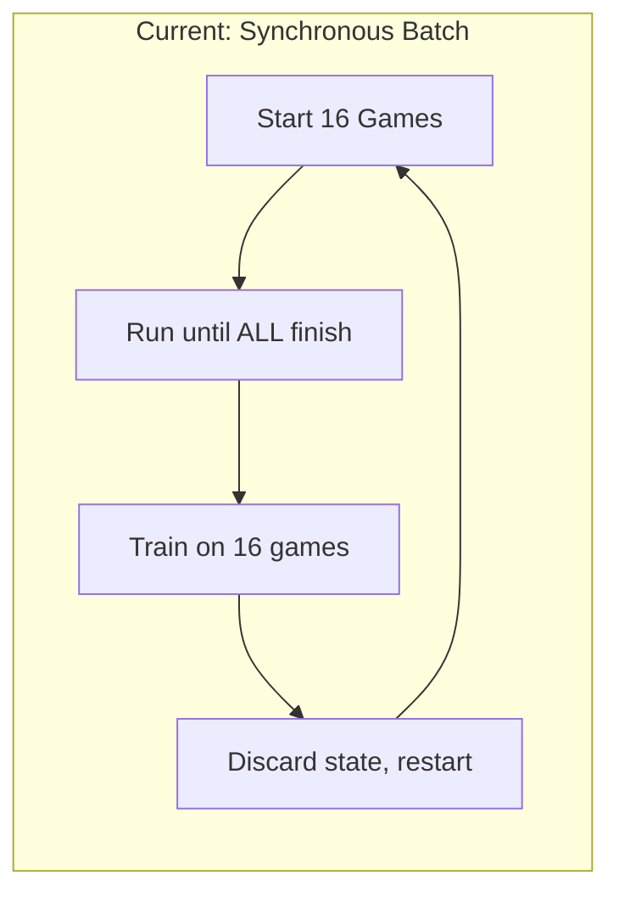
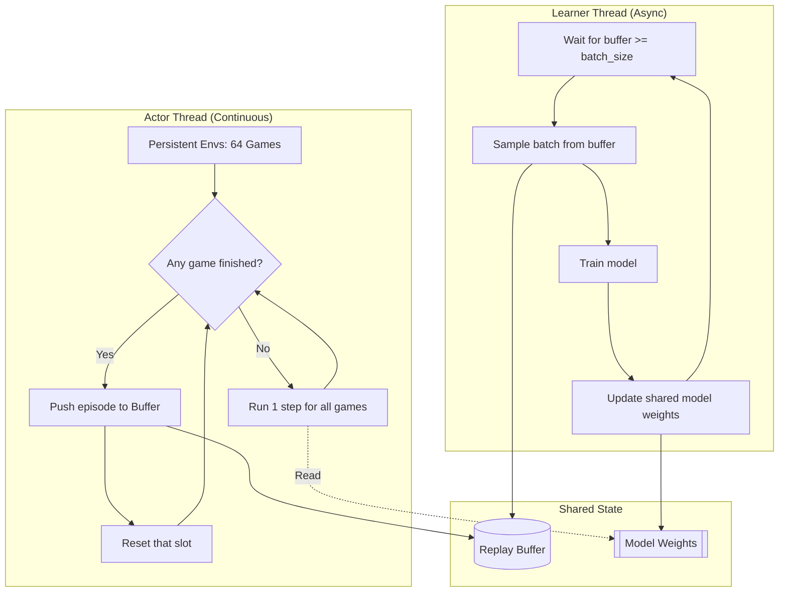

# Async Actor-Learner Architecture Plan

## Goal
Refactor the AlphaLudo training pipeline from synchronous batch-based training to an **Async Actor-Learner** architecture with **Persistent Environments**. This eliminates the "straggler problem" where fast games wait for slow games, maximizing GPU utilization.

---

## Current Architecture (Problems)



| Problem | Impact |
|---------|--------|
| **Straggler Wait** | 15 slots sit idle while 1 slow game finishes |
| **Wasted Compute** | Partially-played games discarded at batch end |
| **Low GPU Utilization** | GPU is only active during MCTS inference, idle during waiting |

---

## Target Architecture



---

## Implementation Steps

### Phase 0: Input Optimization (Channel Repacking)

> [!IMPORTANT]
> Redesigns input tensor to 18 Channels for maximum signal clarity. Requires fresh training.

**Modify**: `src/tensor_utils_mastery.py` and `src/model_mastery.py`

**New Channel Layout (18 Channels)**:

| Group | Channel | Feature | Description |
| :--- | :--- | :--- | :--- |
| **Pieces** | 0-3 | **Player Tokens** | Density (0-4) for [Me, Next, Teammate, Prev] |
| **Board** | 4-7 | **Home Paths** | Binary Mask of private home run corridor for [Me, Next, Team, Prev] |
| | 8 | **Safe Zones** | Constant binary mask of global safe stars |
| **Dice** | 9-14 | **One-Hot Roll** | 6 Channels (Roll 1-6). Entire plane = 1.0 if match. |
| **Context** | 15 | **Score Diff** | `(my_score - max_opp) / 4.0` (Broadcast) |
| | 16 | **Locked State** | `(my_locked + opp_locked_sum) / 16.0` (Broadcast) |
| | 17 | **Race Progress** | `(my_total_steps - max_opp_steps) / 52.0` (Broadcast) |

> [!NOTE]
> **Why 18?**
> - **Restored Home Paths (4-7)**: Critical for the ConvNet to distinguish "common" vs "private" cells. **FIX:** Align indices to 51-55 in both C++ and Python (fixing previous off-by-one bug).
> - **One-Hot Dice (9-14)**: Better for ConvNets than a single scalar plane.
> - **Condensed Context**: Merged locked/progress counts into dense broadcast planes.


---

### Phase 1: Persistent Environments (No Threading Yet)

> [!NOTE]
> This phase keeps the synchronous loop but eliminates the "discard at batch end" problem.

#### Step 1.1: Refactor `VectorLeagueWorker`

**File**: [vector_league.py](file:///c:/Users/ertan/Downloads/alphaludo_export/AlphaLudo_Export/src/vector_league.py)

**Changes**:
1. Move game state arrays to `__init__`:
   - `self.states: List[GameState]` (persistent)
   - `self.histories: List[List[dict]]` (per-game)
   - `self.move_counts: List[int]`
   - `self.game_identities: List[List[str]]`
   - `self.consecutive_sixes: np.ndarray`

2. Add `self.finished_slots: Set[int]` to track which slots have a completed game ready for collection.

3. Modify `play_batch(target_games=16)`:
   - Loop until `len(finished_episodes) >= target_games`
   - When a game finishes:
     - Append its episode to `finished_episodes`
     - **Immediately** reset that slot with a fresh game
   - Return only the `target_games` episodes


### Phase 1.5: C++ GIL Release (Async Enabler)

> [!TIP]
> Enables true multi-core parallelism by releasing the Python GIL during C++ execution.

**Modify**: `src/bindings.cpp`

**Changes**:
1. Add `py::call_guard<py::gil_scoped_release>()` to computationally heavy MCTS methods:
   - `MCTSEngine::select_leaves`
   - `MCTSEngine::expand_and_backprop`
2. This allows the Python "Learner" thread to execute (train GPU) while C++ "Actor" threads simulate MCTS on CPU cores simultaneously.
3. **No Numba rewrite required.** We keep the optimized C++ engine.


#### Step 1.2: Update `train_mastery.py`

**File**: [train_mastery.py](file:///c:/Users/ertan/Downloads/alphaludo_export/AlphaLudo_Export/train_mastery.py)

**Changes**:
1. Instantiate `VectorLeagueWorker` once in `__init__` (not per-batch).
2. `play_batch()` returns episodes; training loop consumes them.
3. No logic changes needed if `play_batch` API stays the same.

---

### Phase 2: Async Actor-Learner

> [!IMPORTANT]
> This phase decouples data collection from training using threads.

#### Step 2.1: Create `AsyncReplayBuffer`

**New File**: `src/async_buffer.py`

```python
import threading
from collections import deque

class AsyncReplayBuffer:
    def __init__(self, max_size=200000):
        self.buffer = deque(maxlen=max_size)
        self.lock = threading.Lock()
    
    def push(self, episode: list):
        with self.lock:
            self.buffer.extend(episode)
    
    def sample(self, batch_size):
        with self.lock:
            # Random sample
            ...
    
    def __len__(self):
        return len(self.buffer)
```

#### Step 2.2: Create Actor Thread with `ActorModel`

**Modify**: `src/vector_league.py`

```python
class AsyncVectorLeagueWorker(VectorLeagueWorker):
    def __init__(self, main_model, ...):
        # We clone the main model for the Actor to avoid .train() vs .eval() conflicts
        self.actor_model = AlphaLudoTopNet().to(device)
        self.actor_model.load_state_dict(main_model.state_dict())
        self.actor_model.eval()
        
        self.main_model_ref = main_model # Reference to sync from
        self.sync_counter = 0

    def run_forever(self):
        while self.running:
            # Sync weights every 10 batches
            if self.sync_counter % 10 == 0:
                 self.actor_model.load_state_dict(self.main_model_ref.state_dict())
            self.sync_counter += 1
            
            # Play using actor_model (safe in eval mode)
            episodes = self.play_batch(...)
            ...
```

#### Step 2.3: Create Learner Thread

**Modify**: `train_mastery.py`

```python
def learner_loop(model, buffer, trainer, device):
    """
    Learner Thread:
    - Owns the 'main_model' (shared_model).
    - Runs in .train() mode.
    - Updates weights via optimizer.
    """
    model.train()
    while True:
        if len(buffer) < BATCH_SIZE:
            time.sleep(0.1)
            continue
        
        batch = buffer.sample(BATCH_SIZE)
        loss = trainer.train_step(batch)
        # Weights update in-place on 'model', which Actor will eventually sync.
```

#### Step 2.4: Main Entry Point

```python
def main():
    # Primary Model (Owned by Learner, source of truth)
    # share_memory() allows efficient reading by other processes/threads
    shared_model = AlphaLudoTopNet().to(device).share_memory()
    
    # ...
```


---

### Phase 3: Dynamic Simulation Schedule

> [!TIP]
> Scales MCTS depth as the model improves.

#### Step 3.1: Add Schedule to `VectorLeagueWorker`

```python
def get_dynamic_sims(self, epoch):
    if epoch < 50:
        return 100
    elif epoch < 500:
        return 200
    else:
        return 500
```

#### Step 3.2: Pass Epoch to `play_batch`

```python
def play_batch(self, target_games=16, epoch=0):
    self.mcts_simulations = self.get_dynamic_sims(epoch)
    ...
```

---

## Edge Cases & Mitigations

| Edge Case | Mitigation |
|-----------|------------|
| **Model Staleness** | Actor uses read-only reference. Learner updates weights in-place using `share_memory()`. Staleness is 1-2 batches max, acceptable for Ludo. |
| **Thread Safety** | `AsyncReplayBuffer` uses `threading.Lock()`. Model updates use PyTorch's built-in thread-safe `share_memory()`. |
| **Ghost Assignment** | Store ghost model per-slot at game start. Persists with the game. |
| **Long Games** | Already capped at 1000 moves. Optionally add timeout (e.g., 5 minutes wall-clock). |
| **Visualizer Sync** | Dashboard shows continuous game IDs. "Batch" concept removed from UI; show "Games/min" throughput instead. |

---

## Files to Modify

| File | Change Type | Summary |
|------|-------------|---------|
| `src/vector_league.py` | Major Refactor | Persistent environments, async actor |
| `train_mastery.py` | Major Refactor | Actor-learner split, threaded entry point |
| `src/async_buffer.py` | **NEW** | Thread-safe replay buffer |
| `src/replay_buffer_mastery.py` | Minor | May be deprecated or merged into async_buffer |
| `index.html` | Minor | Update UI to show throughput instead of batch progress |
| `src/visualizer.py` | Minor | Broadcast "games per minute" metric |

---

## Verification Plan

1. **Unit Test**: `test_async_buffer.py` - Verify thread-safe push/sample.
2. **Integration Test**: Run `train_mastery.py` for 5 minutes, verify:
   - No crashes
   - Buffer grows steadily
   - Model checkpoints are saved
   - Loss decreases
3. **Performance Benchmark**: Measure games/minute before and after. Target: **2x-4x improvement**.

---

### Phase 4: Experiment V2 Update
> [!NOTE]
> Post-implementation task.

**Modify**: `experiment_v2/ui.html`
- Update visualization and tensor extraction logic to match the new 18-channel input stack.
- Ensure the experiment tool can run and visualize the new inputs correctly using the updated C++ engine.

---

## Rollback Plan

If async introduces instability, revert to Phase 1 (Persistent Environments without threading). This still solves the straggler problem and is simpler to debug.
